# A-simple-image-process-software

**运行exe:**
clone到本地后点击imageProcess里的opencv-image.exe可以直接运行exe。
**注意：绝对路径不能包含中文**，因为qt无法正确解析中文路径。

**代码运行环境：Windows, Qt5.14.2,Opencv 4.3.0. 需要改动.pro文件里的库路径**

## 简介
一个基于QML和C++的简单高效率的图像处理软件，实现了快速调节亮度，对比度，饱和度，色相（效率堪比photoshop）等基础功能。同时还实现了对图片进行裁剪，旋转，添加滤镜，添加文字等功能。

在此基础上，还实现了一些基本的图像处理功能，包括灰度变换、边缘提取、伽马矫正、均值/中值滤波，拉普拉斯锐化等。同时还提供了一些基于频率域的功能，比如显示频谱图，高斯低通/高通滤波，逆滤波复原等。

### 初始界面
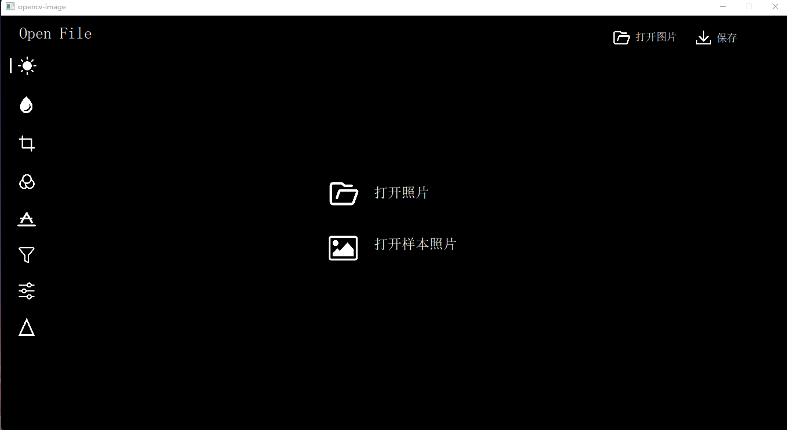
### 基础功能
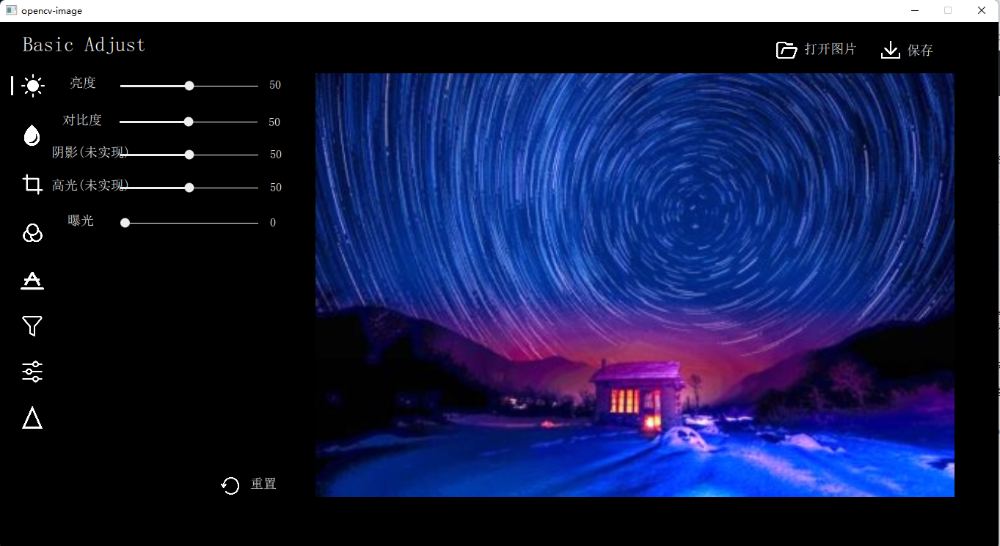
### 调整颜色
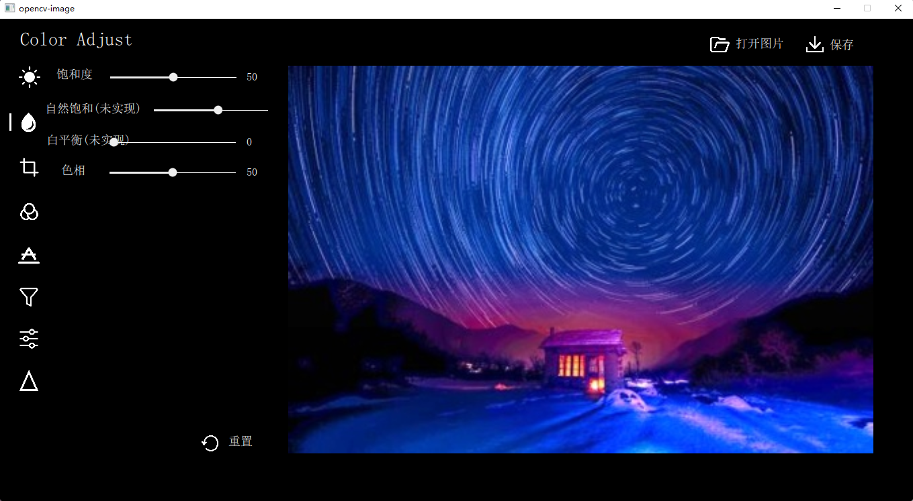
### 裁剪和旋转
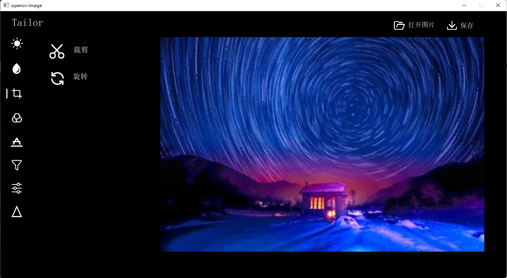
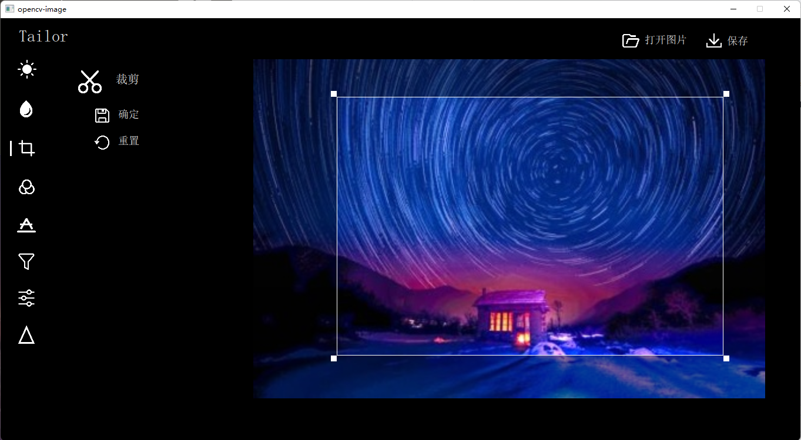
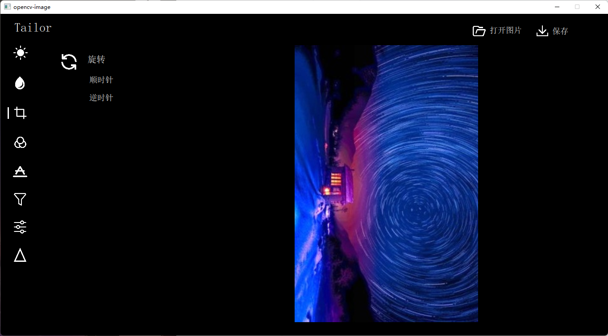
### 添加滤镜
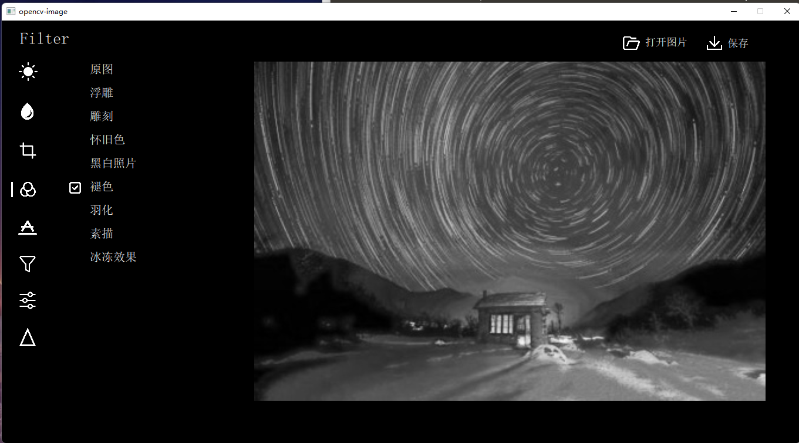
### 添加文本
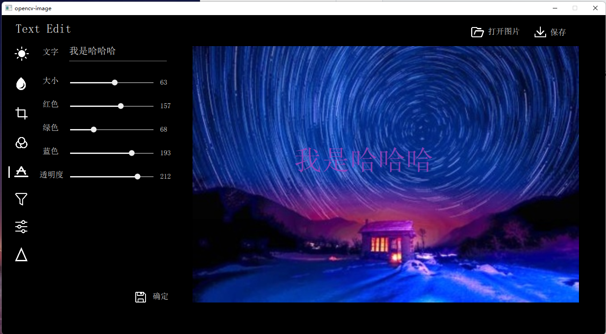
### 基础图像处理
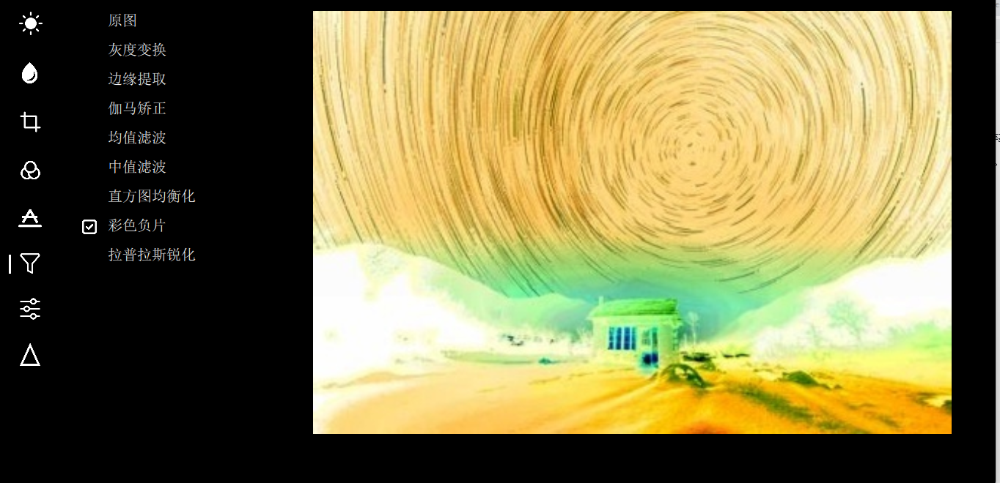
### 频率域图像处理
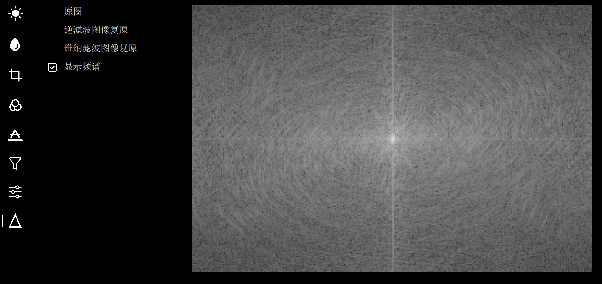
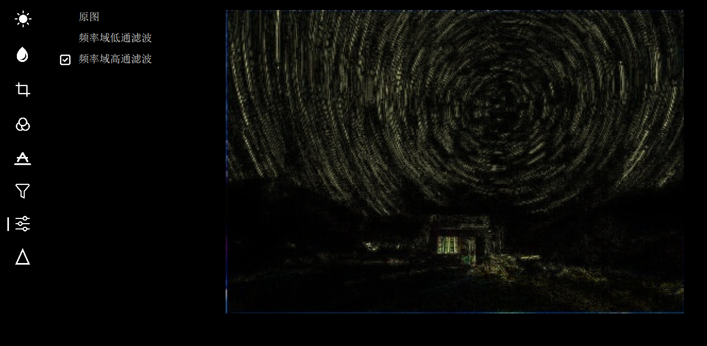
